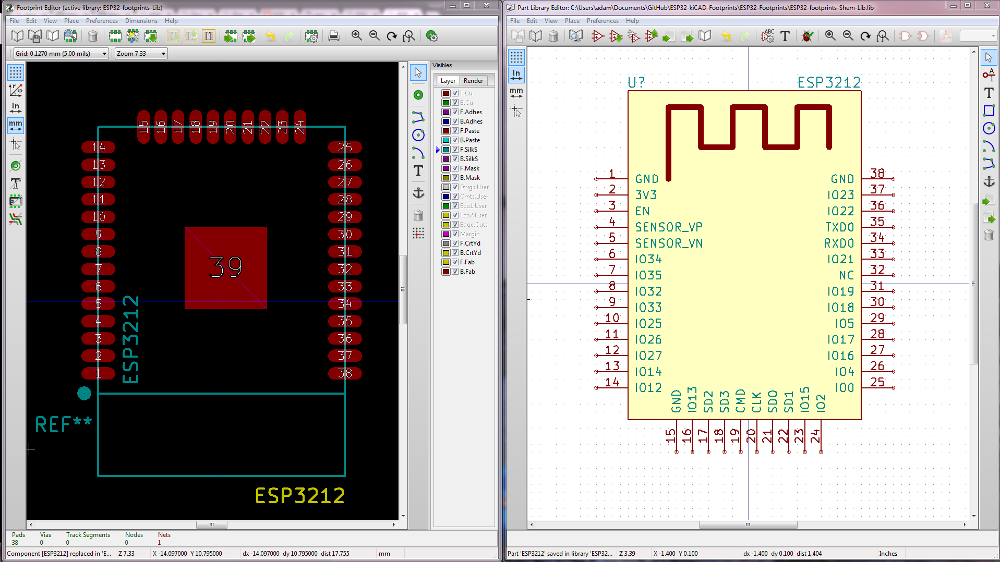
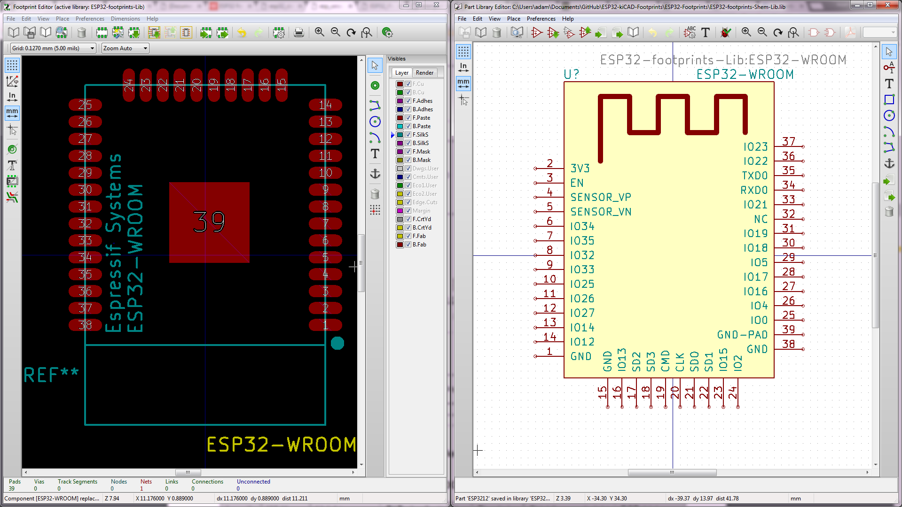
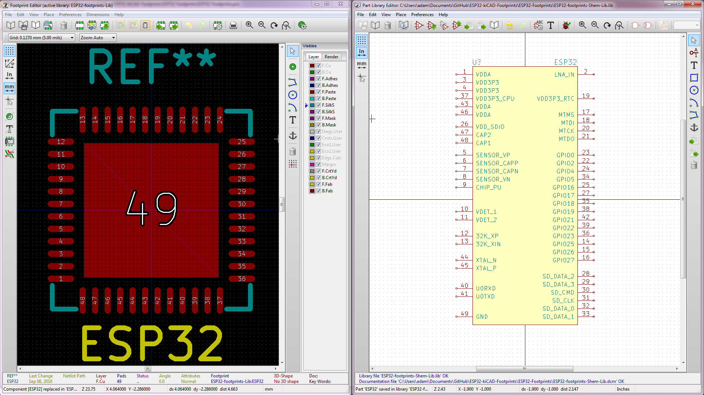
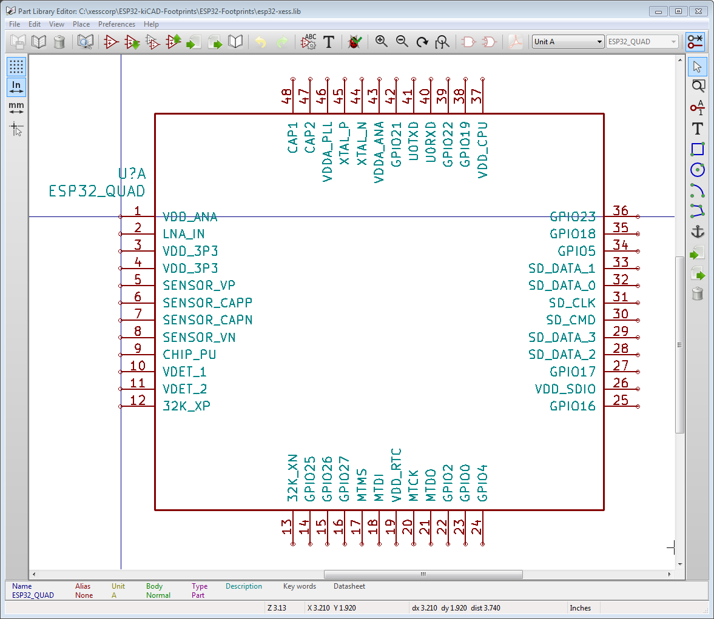

# ESP32-kiCAD-Footprints

Footprints for the Espressif ESP32 WiFi/BLE Chip and ESP3212 module, for KiCAD EDA
These footprints are current untested use at your own risk! I'll have a test board
soon!

Now includes an alternate esp32-xess.lib schematic library in which the 
pin types of the ESP32 chip and modules have been changed to reflect their
actual functions (before they were all set as inputs).
This library also includes a symbol for the ESP32 chip that has the pins arranged
like the 48-pin QFN package.

ESP3212 - Module

ESP32-WROOM - module

ESP32 - 48 Pin QFN IC

ESP32 - 48 Pin QFN IC (XESS)

